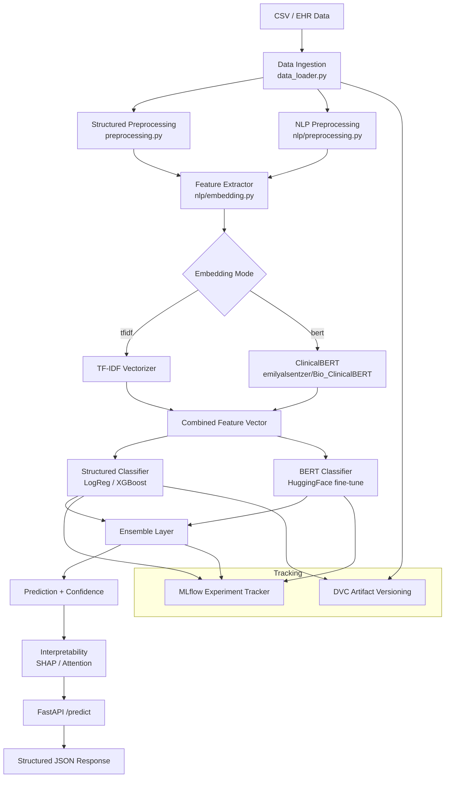

# Design Document

## Overview

The diabetes-classifier is a production-ready, end-to-end ML system that classifies patient diabetes type (Type 1, Type 2, Gestational, Other) from a combination of structured EHR data and unstructured clinical notes. The system is designed around a modular pipeline architecture: raw data flows through ingestion, preprocessing, feature extraction, model training/inference, and is served via a FastAPI REST API packaged in Docker.

The dual-modality approach — structured numeric features (age, BMI, glucose, insulin) fused with ClinicalBERT embeddings from free-text notes — is the core technical differentiator. An ensemble layer combines a scikit-learn/XGBoost structured classifier with a fine-tuned BERT classifier to maximize predictive performance. All experiments are tracked via MLflow and datasets/artifacts are versioned with DVC.

Key design goals:
- Reproducibility: fixed seeds, DVC-versioned data, MLflow experiment tracking
- Interpretability: SHAP values for structured models, attention weights for BERT
- Safety: medical-grade evaluation (macro F1 ≥ 0.70 threshold, per-class recall for rare classes)
- Operability: Docker deployment, health endpoint, structured request logging, drift detection

---

## Architecture



### Component Interaction Summary

- `DataLoader` reads CSV → produces raw `pd.DataFrame`
- `StructuredPreprocessor` normalizes, clips, encodes, optionally applies SMOTE
- `NLPPreprocessor` lowercases, replaces PHI, segments sentences, extracts NER entities
- `FeatureExtractor` produces TF-IDF or BERT embeddings, concatenates with structured features
- `ModelTrainer` trains baseline (LogReg, DecisionTree), XGBoost, BERT fine-tune, and Ensemble
- `Evaluator` runs stratified 5-fold CV, computes all metrics, saves plots
- `InferenceAPI` (FastAPI) loads serialized artifacts, runs inference pipeline, returns prediction + explanation
- `DriftDetector` computes PSI per feature on inference batches
- `ExperimentTracker` wraps MLflow logging throughout training

---

## Components and Interfaces

### DataLoader (`utils/data_loader.py`)

```python
class DataLoader:
    def load(self, path: str) -> pd.DataFrame: ...
    # Raises FileNotFoundError with path in message if file missing
    # Logs and skips malformed rows; imputes/flags missing structured fields
```

Configuration key: `ingestion.missing_strategy` ∈ `{mean, median, drop}`

### StructuredPreprocessor (`nlp/preprocessing.py`)

```python
class StructuredPreprocessor:
    def fit(self, df: pd.DataFrame) -> None: ...          # computes train-split stats
    def transform(self, df: pd.DataFrame) -> np.ndarray: ...
    def fit_transform(self, df: pd.DataFrame) -> np.ndarray: ...
    def serialize(self, path: str) -> None: ...
    def deserialize(self, path: str) -> None: ...
```

- Normalizes `[age, bmi, glucose, insulin]` to zero mean / unit variance (train stats only)
- Clips values outside ±3σ to the boundary
- Encodes target label to `int ∈ [0, 3]` via `LabelEncoder`
- Applies SMOTE when any class < 15% of training samples

### NLPPreprocessor (`nlp/preprocessing.py`)

```python
class NLPPreprocessor:
    def preprocess(self, notes: list[str]) -> list[str]: ...
    def extract_entities(self, notes: list[str]) -> list[dict]: ...
```

- Lowercases text
- Replaces PHI tokens (`[NAME]`, `[DOB]`, `[ID]`, etc.) with `<PHI>`
- Segments into sentences via spaCy `sentencizer`
- Substitutes empty/null notes with configurable default string
- Extracts NER entities (symptoms, medications, lab values) via spaCy model

### FeatureExtractor (`nlp/embedding.py`)

```python
class FeatureExtractor:
    def fit(self, notes: list[str]) -> None: ...
    def transform(self, structured: np.ndarray, notes: list[str]) -> np.ndarray: ...
    def serialize(self, path: str) -> None: ...
    def deserialize(self, path: str) -> None: ...
```

- `mode="tfidf"`: fits/transforms TF-IDF (max 10,000 features)
- `mode="bert"`: mean-pools last hidden layer of `emilyalsentzer/Bio_ClinicalBERT` → 768-dim vector
- Concatenates structured vector + text embedding → combined feature vector
- Serializes fitted TF-IDF vectorizer and BERT tokenizer config to disk

### ModelTrainer (`models/train.py`)

```python
class ModelTrainer:
    def train_baseline(self, X: np.ndarray, y: np.ndarray) -> dict[str, Any]: ...
    def train_bert(self, notes: list[str], y: np.ndarray) -> BertClassifier: ...
    def train_ensemble(self, structured_model, bert_model, X, notes, y) -> EnsembleClassifier: ...
```

- Trains LogisticRegression and DecisionTreeClassifier baselines
- Fine-tunes `Bio_ClinicalBERT` for 4-class classification
- Ensemble combines probability outputs with configurable weights
- All runs use fixed random seed for reproducibility

### Evaluator (`models/evaluate.py`)

```python
class Evaluator:
    def evaluate(self, model, X, y, model_name: str) -> dict: ...
    # Returns: macro_f1, weighted_f1, roc_auc, per_class_recall, confusion_matrix
    # Saves PNG plots to experiments/{model_name}_{timestamp}/
```

- Stratified 5-fold CV
- Logs warning when macro F1 < 0.70
- Saves confusion matrix, ROC curves, calibration curve as PNG

### InferenceEngine (`models/inference.py`)

```python
class InferenceEngine:
    def predict(self, record: PatientRecord) -> PredictionResult: ...
    def explain(self, record: PatientRecord, model_type: str) -> dict: ...
```

- Loads serialized artifacts on startup; raises descriptive error if any artifact missing
- Returns `prediction`, `confidence`, `explanation`
- SHAP values for structured classifier (top 5 features)
- Decision path for DecisionTree
- Top 5 attention-weighted tokens for BERT

### InferenceAPI (`api/main.py`)

```python
# POST /predict  → PredictionResponse
# GET  /health   → {"status": "ok"}
# POST /drift-report → DriftReport  (bonus)
```

- FastAPI with Pydantic request/response schemas
- Returns HTTP 422 on missing fields, HTTP 500 on internal errors
- Structured JSON request logging (no raw notes content)
- JWT bearer token auth on all endpoints except `/health` (bonus)

### DriftDetector (`pipelines/inference_pipeline.py`)

```python
class DriftDetector:
    def compute_psi(self, reference: np.ndarray, current: np.ndarray) -> dict[str, float]: ...
```

- PSI per structured numeric feature
- Logs warning when PSI > 0.2

### ExperimentTracker (`utils/logger.py`)

Thin wrapper around MLflow:
- Creates/resumes run under `"diabetes-classifier"` experiment
- Logs params, metrics, artifacts
- Registers best model in MLflow Model Registry as `"diabetes-classifier-production"`

---

## Data Models

### Pydantic Schemas (`api/schemas.py`)

```python
class PatientRecord(BaseModel):
    age: int
    bmi: float
    glucose: float | None = None
    insulin: float | None = None
    notes: str

class ExplanationItem(BaseModel):
    feature: str
    score: float

class PredictionResponse(BaseModel):
    prediction: str          # "Type 1" | "Type 2" | "Gestational" | "Other"
    confidence: float        # [0.0, 1.0]
    explanation: dict        # {"top_features": [...], "tokens": [...], "decision_path": [...]}

class HealthResponse(BaseModel):
    status: str              # "ok"

class DriftReport(BaseModel):
    psi_scores: dict[str, float]   # feature_name -> PSI value
    warnings: list[str]            # features exceeding PSI threshold
```

### Internal Data Structures

```python
# Label mapping (consistent, reproducible)
LABEL_MAP = {0: "Type 1", 1: "Type 2", 2: "Gestational", 3: "Other"}

# NER entity metadata stored alongside each record
EntityMetadata = TypedDict("EntityMetadata", {
    "symptoms": list[str],
    "medications": list[str],
    "lab_values": list[str],
})

# MLflow run metadata
RunConfig = TypedDict("RunConfig", {
    "model_type": str,
    "embedding_mode": str,   # "tfidf" | "bert"
    "random_seed": int,
    "n_train_samples": int,
    "hyperparameters": dict,
})
```

### Serialized Artifact Layout

```
experiments/
  {model_name}_{timestamp}/
    confusion_matrix.png
    roc_curves.png
    calibration_curve.png

models/
  scaler.pkl
  label_encoder.pkl
  tfidf_vectorizer.pkl
  bert_tokenizer_config.json
  structured_classifier.pkl
  bert_classifier/          # HuggingFace saved model dir
  ensemble_weights.json
```

### Configuration (`utils/config.py`)

```python
@dataclass
class Config:
    ingestion: IngestionConfig      # csv_path, missing_strategy
    preprocessing: PreprocConfig    # clip_sigma=3.0, smote_threshold=0.15
    nlp: NLPConfig                  # default_notes_text, phi_tokens
    embedding: EmbeddingConfig      # mode="bert"|"tfidf", bert_model_name
    training: TrainingConfig        # random_seed, ensemble_weights, class_weights
    evaluation: EvaluationConfig    # min_macro_f1=0.70, n_folds=5
    api: APIConfig                  # host, port=8000, log_level
    mlflow: MLflowConfig            # tracking_uri, experiment_name
```

---
